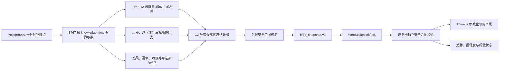

# 软熔带移动预测趋势实现记录

## 1. 文档信息

| 项目 | 内容 |
|---|---|
| 需求编号 | `REQ-BF3D-C2-ROOT-MOTION-20260719` |
| 当前模型版本 | `C2-ROOT-BASELINE-2026.07` |
| 当前实现状态 | 代码链路与确定性验收已完成；现场在线值尚未验收 |
| 证据等级 | `estimated` |
| 标定状态 | `uncalibrated` |
| 控制用途 | `prohibited` |
| 置信度上限 | `0.45` |
| 根部定义 | `wall_thermal_activity_centroid` |
| 方位定义 | `sensor_relative_A_zero`，A 点绝对厂区方位尚未确认 |
| 最后更新 | 2026-07-20 |

本文记录软熔带“根部上移/下移、厚度和偏心”预测从数据读取、特征计算、
结果发布到 Three.js 展示的完整实现方式，供后续回测、参数调整、专家标定
和生产验收使用。

当前结果是炉墙侧热活动根部的低置信度代理，不是炉内直接测得的
1000℃ 等温面，也不是完整倒 V/W 型软熔带真值。

## 2. 当前解决的问题

第一版只回答以下实用问题：

1. 软熔带炉墙侧根部相对上一历史窗口是上移、下移还是基本稳定；
2. 当前根部代理标高约为多少米；
3. 以当前速度作 15 分钟常速外推后，根部可能到达什么标高；
4. 当前软熔带估计厚度是多少；“变厚/变薄”需要比较连续快照，当前合同尚未
   单独输出厚度方向；
5. 周向是否存在偏心，偏心朝向哪个相对测温方位；
6. A～H 八个方位各自的根部中心、上沿和下沿是多少；
7. 当前输入覆盖率、置信度、不确定区间和主要驱动项是什么。

本阶段不解决：

- 完整软熔带中心顶点和真实倒 V/W 曲面反演；
- CFD/DEM 在线求解；
- 炉内真实软熔温度直接测量；
- 自动控制设定值计算；
- 未经专家标定的报警阈值。

## 3. 实现总链路



核心实现位置：

| 层级 | 说明 | 实现位置 |
|---|---|---|
| 模型配置 | 时间窗口、输入门禁、几何范围、权重和安全边界 | [cohesive_zone_estimator.yaml:L1-L246](../炉况规则引擎/config/cohesive_zone_estimator.yaml#L1-L246) |
| 估计器 | 根部、速度、厚度、偏心、置信度和输出合同 | [CohesiveZoneEstimator.estimate:L1015-L1466](../炉况规则引擎/features/cohesive_zone_estimator.py#L1015-L1466) |
| 公共函数 | 稳定的估计器调用入口 | [estimate_cohesive_zone:L1469-L1485](../炉况规则引擎/features/cohesive_zone_estimator.py#L1469-L1485) |
| 数据读取 | 从 `bf_sensor.one_minute_values` 读取知识时间之前的数据 | [fetch_cohesive_zone_input_frame:L554-L592](../自动诊断服务/local_pg_ws_bridge.py#L554-L592) |
| 后端合同门 | 可用结果发布前的范围与安全元数据校验 | [_validate_cohesive_zone_available_contract:L709-L799](../自动诊断服务/local_pg_ws_bridge.py#L709-L799) |
| 快照构建 | 生成 `bf3d_snapshot.v1` 并安全降级 | [build_bf3d_snapshot:L1087-L1218](../自动诊断服务/local_pg_ws_bridge.py#L1087-L1218) |
| 前端合同门 | 防止越过 8767 注入不安全快照 | [validateLiveCohesiveEstimate:L160-L282](../高炉前端数据/assets/bf3d-internal-simulation.js#L160-L282) |
| Three.js 对象 | 参数化软熔带壳、置信区间和状态 | [createCohesiveSystem:L1640-L2009](../高炉前端数据/assets/bf3d-internal-simulation.js#L1640-L2009) |
| 快照应用 | 新鲜度与合同通过后才显示几何 | [applySnapshot:L2811-L2944](../高炉前端数据/assets/bf3d-internal-simulation.js#L2811-L2944) |
| 可观察状态 | `data-cohesive-*` 与运行状态 API | [syncUi:L3297-L3392](../高炉前端数据/assets/bf3d-internal-simulation.js#L3297-L3392) |

## 4. 输入数据

### 4.1 核心温度输入

当前模型使用 L7～L13 共 7 个标高、每层 A～H 八个方位的 56 个炉体温度点：

| 层 | 标高/m | 点位 |
|---|---:|---|
| L7 | 16.860 | `T_body_L7_A`～`T_body_L7_H` |
| L8 | 18.335 | `T_body_L8_A`～`T_body_L8_H` |
| L9 | 20.125 | `T_body_L9_A`～`T_body_L9_H` |
| L10 | 21.860 | `T_body_L10_A`～`T_body_L10_H` |
| L11 | 23.711 | `T_body_L11_A`～`T_body_L11_H` |
| L12 | 25.441 | `T_body_L12_A`～`T_body_L12_H` |
| L13 | 27.171 | `T_body_L13_A`～`T_body_L13_H` |

温度有效范围暂定为 `-20～600℃`。这些点测量的是炉墙/炉体安装位置温度，
不能直接解释为炉料软化温度。

L14～L16 的测温点和 3D 分层仍保留，但当前根部估计器正式范围只使用
L7～L13，避免在尚未标定前随意扩张模型范围。

### 4.2 压差与透气性

核心压力概念包括：

- `DP_total`
- `DP_lower`
- `DP_upper`
- `PI`

各变量相对参考窗口的变化先除以各自尺度并限制到 `[-1, 1]`，再按配置权重
合成为压力阻力指数。`PI` 的方向与压差相反。

### 4.3 三标高静压力

模型支持 18 个静压力点：

- 下部：`P_static_lower_A～F`，标高 20.350m；
- 中部：`P_static_middle_A～F`，标高 23.488m；
- 上部：`P_static_upper_A～F`，标高 28.976m。

也支持三个原有均值代理：

- `P_static_20m35`
- `P_static_23m49`
- `P_static_28m98`

至少两个有效静压力标高才能构成纵向静压梯度概念。单个标高不会被包装成
完整静压力场。

### 4.4 可选热力修正

以下变量只对根部中心作小幅、有界修正：

- `Q_blast`
- `T_blast`
- `Q_O2`
- `O2_rate`
- `PCI_rate` / `PCI_set`
- `TFT`

`Q_O2` 与 `O2_rate` 使用不同单位和尺度，不能混为同一变量。热力修正总增益
仅为 `0.35m`，目的是提供小幅上下文校正，不允许盖过炉体温度高度剖面。

每个实际参与计算的驱动项都记录：

- 当前窗口值；
- 参考窗口值；
- 归一化贡献；
- 当前采样时间；
- 参考采样时间。

### 4.5 仅作上下文的数据

以下数据目前只记录上下文覆盖率，不提高模型置信度：

- 炉顶温度；
- 炉顶压力；
- `GasUtil`；
- `L`、`L_south`、`L_north`；
- `Hopper_weight`。

原因是料线零点、正方向、南北尺语义和真实布料—下降链路尚未完成现场冻结。

## 5. 时间窗口和数据新鲜度

设当前评价时间为 `t0`：

```text
参考窗口：t0-45min ～ t0-30min
隔离区间：t0-30min ～ t0-15min
当前窗口：t0-15min ～ t0
```

两个窗口中心相隔 30 分钟，即 `0.5h`。

固定规则：

- 输入频率按一分钟数据处理；
- 每个传感器每个窗口至少需要 5 个有效样本；
- 查询和估计均禁止读取 `t0` 之后的数据；
- 不使用 `bfill`，不能用未来值填补过去缺测；
- 炉体温度最大允许年龄为 5 分钟；
- 压差、透气性和静压力最大允许年龄为 5 分钟；
- 热风、富氧和喷煤等热力修正逐概念执行 5 分钟新鲜度检查；
- 陈旧的核心温度/压力会使结果 `unavailable`；
- 陈旧的可选热力项只被忽略，不会阻断主估计，也不会制造虚假上移。

8767 默认回读 480 分钟历史，但配置下限被强制限制为 45 分钟，避免环境变量
误配后无法形成完整参考、隔离和当前窗口。

## 6. 核心算法

### 6.1 建立共同数据支撑

当前窗口和参考窗口必须使用相同的 `(层, 方位)` 数据支撑：

1. 每层至少有 4 个当前/参考共同方位；
2. 至少有 5 个当前/参考共同层；
3. 计算偏心时至少有 6 个共同方位；
4. 缺少共同支撑时返回明确原因码，不生成貌似合理的几何体。

这一门禁避免“当前窗口缺上层、参考窗口缺下层”被误判为软熔带发生移动。

共同支撑实现见
[_comparable_body_profiles:L439-L483](../炉况规则引擎/features/cohesive_zone_estimator.py#L439-L483)。

### 6.2 计算炉墙热活动根部中心

对每个共同层，先取共同方位温度的中位数，得到高度—温度剖面。

设第 `i` 层标高为 `h_i`、层温为 `T_i`：

```text
T_norm_i = clamp((T_i - T_min) / max(T_max - T_min, 1℃), 0, 1)
w_i = 0.10 + T_norm_i ^ 1.60
H_temp = Σ(h_i × w_i) / Σw_i
```

`H_temp` 是“炉墙热活动中心”，不是炉内真实软熔温度边界。

实现见
[_profile_centre:L405-L437](../炉况规则引擎/features/cohesive_zone_estimator.py#L405-L437)。

### 6.3 热力修正

对每个新鲜的热力变量计算：

```text
delta_j = clamp((current_j - reference_j) / scale_j, -1, 1)
thermal_index = weighted_mean(delta_j × direction_j)
H_current = clamp(H_temp_current + 0.35 × thermal_index, 15.0, 28.5)
```

陈旧热力变量不进入 `thermal_index`。

当前基线实现只把该热力修正叠加到当前窗口中心 `H_temp_current`。参考窗口
`H_reference` 使用参考温度剖面的未修正中心，不再单独叠加一份参考热力修正；
因此后续速度实际表达的是“经当前热力驱动修正后的当前中心”相对“参考温度剖面
中心”的变化。

归一化变化和驱动记录由
[_concept_delta_index:L485-L559](../炉况规则引擎/features/cohesive_zone_estimator.py#L485-L559)
完成。

### 6.4 判断上移、下移和稳定

参考窗口从参考温度剖面计算未叠加热力修正的中心 `H_reference`：

```text
velocity = clamp(
  (H_current - H_reference) / 0.5h,
  -2.40m/h,
  +2.40m/h
)
```

方向判断：

```text
velocity > +0.12m/h  → up
velocity < -0.12m/h  → down
其他                 → stable
```

注意：这是两个窗口间的状态变化率，不是炉料颗粒真实运动速度。

### 6.5 15 分钟趋势外推

第一版只做常速外推：

```text
H_15min = clamp(H_current + velocity × 15/60, 15.0, 28.5)
```

输出必须携带：

```text
forecast_horizon_minutes=15
forecast_assumption=constant_velocity_uncalibrated
```

它适合显示短时方向和趋势，不代表时序模型已经学习到非线性工况变化。

当前实现没有持久化 C2 历史序列，也没有生成一条可回放的历史趋势曲线；
`H_15min` 只是一个未标定的 15 分钟常速单点外推。输出中的
`uncertainty_low_m/uncertainty_high_m` 是依据当前置信度生成的几何展示包络，
不是 `p10/p50/p90` 预测分位区间。若要展示“变厚/变薄”或连续移动轨迹，必须
先持久化连续快照，再对相邻有效时间点计算变化。

### 6.6 估计厚度

厚度同时参考压力阻力变化和炉体温度高度分布宽度：

```text
thickness =
  2.10
  + 0.85 × pressure_resistance_index
  + 0.08 × (body_profile_spread - 3.50)

thickness = clamp(thickness, 1.20, 4.50)
```

压力增大可能使估计带变厚，但这只是有界代理关系，不是软化矿层真实厚度测量。

### 6.7 计算周向偏心

为了避免不同标高温度基线差异制造伪偏心：

1. 每一层先减去该层共同方位均值；
2. 只保留所有参与层都存在的共同方位；
3. 各共同方位残差跨层取中位数；
4. 静压力也按同样方式逐标高去均值；
5. 分别计算温度场和静压力场的一阶圆周谐波；
6. 按 `0.82 × 温度向量 + 0.18 × 静压力向量` 合成偏心方向。

温度和静压力归一化尺度分别为 `8℃`、`6kPa`，最大偏心量限制为 `0.75m`。

实现见：

- [_balanced_residual_profile:L740-L793](../炉况规则引擎/features/cohesive_zone_estimator.py#L740-L793)
- [_harmonic_vector:L719-L737](../炉况规则引擎/features/cohesive_zone_estimator.py#L719-L737)

八个方位根部由下式生成：

```text
H_sector = H_current + eccentricity × cos(theta_sector - eccentric_angle)
lower = H_sector - thickness/2
upper = H_sector + thickness/2
```

A～H 当前按相对角度 `0°、45°、90°……315°` 表示。未确认 A 点绝对厂区方位前，
界面不得显示“东、南、西、北”等绝对方向。

### 6.8 置信度和不确定区间

置信度受以下因素共同限制：

- 核心输入覆盖率；
- 炉体温度层覆盖率；
- 共同方位覆盖率；
- 当存在周向静压力支撑但仅有部分共同方位时，相应覆盖折减。

特别说明：18 点周向静压力支撑完全缺失时，当前实现令
`static_support_factor=1`，不会仅因这一项单独再次扣减置信度；压力/透气性组
是否有 `DP_upper`、`DP_lower`、`DP_total`、`PI` 等有效输入，仍会通过该输入组
覆盖率影响总置信度。只有已经存在周向静压力偏心支撑、但共同方位不完整时，
`static_support_factor` 才按平衡覆盖率折减。

输入组权重为：

| 输入组 | 权重 |
|---|---:|
| 炉体温度 | 0.65 |
| 压力/透气性 | 0.25 |
| 热力修正 | 0.10 |
| 炉顶分布上下文 | 0.00 |
| 料线/下降上下文 | 0.00 |

最终置信度无论覆盖率多高都不得超过 `0.45`。不确定区间根据置信度在
`0.55～1.80m` 之间变化。

## 7. 输出数据合同

可用结果写入：

```text
bf3d_snapshot.v1
└─ estimated
   └─ cohesive_zone
```

示意结构如下。数值仅用于解释字段，不代表当前现场炉况：

```json
{
  "status": "available",
  "centerHeight": 18.35,
  "thickness": 2.30,
  "innerRadius": 0.90,
  "outerRadius": 3.85,
  "eccentricity": 0.28,
  "eccentricAngle": 0.52,
  "amplitude": 2.15,
  "uncertainty": 0.58,
  "shape": "eccentric",
  "movement": {
    "direction": "up",
    "velocity_m_per_h": 0.36,
    "forecast_horizon_minutes": 15,
    "forecast_height_m": 18.44,
    "forecast_assumption": "constant_velocity_uncalibrated"
  },
  "confidence": 0.42,
  "input_coverage": 0.88,
  "evidence": "estimated",
  "model_version": "C2-ROOT-BASELINE-2026.07",
  "calibration_status": "uncalibrated",
  "control_use": "prohibited",
  "root_definition": "wall_thermal_activity_centroid",
  "azimuth_reference": "sensor_relative_A_zero",
  "absolute_azimuth_status": "unconfirmed"
}
```

完整结果还包含：

- `sector_roots[A..H]`
- `sample_time`
- `context_coverage`
- `quality.coverage_by_group`
- `quality.latest_time_by_group`
- `quality.body_temporal_support`
- `quality.body_sector_support`
- `quality.static_pressure_sector_support`
- `quality.latent_indices`
- `quality.drivers`
- `quality.warnings`

时间口径：`sample_time` 取当前窗口内最新有效炉体温度时间；不同输入组各自的
最新有效时间保存在 `quality.latest_time_by_group`，不能用一个统一时间戳掩盖
压力、静压力或热力输入的滞后。

## 8. 8767 发布与故障降级

### 8.1 运行配置

| 环境变量 | 默认值 | 下限 | 含义 |
|---|---:|---:|---|
| `BF_WS_COHESIVE_ZONE_ENABLED` | `1` | — | 是否启用估计器 |
| `BF_WS_COHESIVE_ZONE_HISTORY_MINUTES` | `480` | `45` | 读取历史分钟数 |
| `BF_WS_COHESIVE_ZONE_COMPUTE_INTERVAL_SECONDS` | `60` | `1` | 重算间隔 |
| `BF_WS_COHESIVE_ZONE_STALE_AFTER_SECONDS` | `600` | `60` | 快照数据陈旧阈值 |
| `BF_WS_COHESIVE_ZONE_CONFIG_PATH` | 空 | — | 可选参数文件覆盖路径 |

配置入口见
[local_pg_ws_bridge.py:L36-L54](../自动诊断服务/local_pg_ws_bridge.py#L36-L54)。

### 8.2 缓存和知识时间

缓存同时绑定数据库主机、端口、数据库和读取策略。只有满足以下条件才复用：

- 数据源标识一致；
- 缓存知识时间不晚于本次评价时间；
- 未超过重算间隔。

先请求 12:00、再回放 11:00 时必须重新计算，不能把 12:00 的未来结果泄漏到
11:00。

### 8.3 安全失败

出现以下情况时，8767 仍继续发送原有 `init/tick`，但：

```text
estimated.cohesive_zone = null
```

同时在质量字段中记录原因：

- 数据库取数失败；
- 输入为空；
- 共同层或共同方位不足；
- 核心温度或压力陈旧；
- 估计器异常；
- 结果违反合同；
- 快照构建出现未预期异常。

安全包装见
[safe_build_bf3d_snapshot:L1220-L1229](../自动诊断服务/local_pg_ws_bridge.py#L1220-L1229)。

## 9. Three.js 趋势展示

浏览器接收 `bf3d_snapshot` 后：

1. 缓存到 `window.__BF3D_LATEST_SNAPSHOT__`；
2. 触发 `bf3d:snapshot` 事件；
3. 再执行一套独立合同检查；
4. 通过后更新软熔带参数化网格；
5. 未通过时隐藏网格，并显示“C2 输出合同无效，几何已隐藏”。

页面快照发布位置：
[publishBf3dSnapshot:L7585-L7592](../高炉前端数据/frontend_dashboard_v3.server.html#L7585-L7592)。

可视化内容包括：

- 橙色半透明软熔带壳；
- 厚度变化；
- 周向偏心；
- 估计不确定区间；
- 上移、下移或稳定状态；
- 根部标高、厚度和置信度；
- 陈旧、无数据和合同无效状态。

示例状态行：

```text
未标定估计 · 禁止控制 · ↑上移 · 根部 18.35m · 厚度 2.30m · 置信度 42%
```

前端暴露的主要验收属性：

```text
data-cohesive-visible
data-cohesive-direction
data-cohesive-velocity-m-per-h
data-cohesive-root-height-m
data-cohesive-thickness-m
data-cohesive-eccentricity-m
data-cohesive-confidence
data-cohesive-input-coverage
data-cohesive-calibration-status
data-cohesive-control-use
data-cohesive-contract-state
data-cohesive-contract-issues
```

数据从新鲜变为陈旧时保留并明确标记；超过前端硬失效阈值后隐藏；收到新的
合规快照后自动恢复。

## 10. 双重安全合同

8767 和浏览器分别校验：

- `status=available`
- `evidence=estimated`
- 几何字段为有限数且处于允许范围；
- 外半径大于内半径；
- 厚度没有超出炉体显示边界；
- `movement.direction` 只能是 `up/down/stable`；
- 速度和预测标高处于有界范围；
- 预测假设为 `constant_velocity_uncalibrated`；
- 样本时间合法且不晚于知识时间；
- `confidence<=0.45`；
- `calibration_status=uncalibrated`；
- `control_use=prohibited`；
- 根部定义和方位参考与当前版本一致。

自动化反例已经证明：

```text
confidence=0.9
calibration_status=calibrated
control_use=allowed
```

即使绕过后端直接注入浏览器，也会被前端拒绝并隐藏几何。

## 11. 已完成验证

### 11.1 Python 估计器和桥接测试

```powershell
python -m pytest `
  .\tests\test_cohesive_zone_estimator.py `
  .\tests\test_local_pg_ws_bridge_cohesive_zone.py -q
```

当前结果：`34 passed`。

覆盖：

- 上移、下移和稳定；
- 15 分钟外推；
- 厚度变化；
- 热方位偏心；
- 当前/参考共同层；
- 不均衡缺测不制造偏心；
- 静压力共同标高/方位；
- 陈旧压力拒绝；
- 陈旧热力变量忽略；
- `Q_O2/O2_rate` 单位分离；
- 禁止未来数据泄漏；
- 缓存按知识时间和数据源隔离；
- 后端合同无效结果隐藏；
- 安全降级不破坏 8767。

测试位置：

- [估计器测试:L84-L392](../tests/test_cohesive_zone_estimator.py#L84-L392)
- [8767 桥接测试:L143-L477](../tests/test_local_pg_ws_bridge_cohesive_zone.py#L143-L477)

### 11.2 Three.js 专项

```powershell
node --check .\高炉前端数据\assets\bf3d-internal-simulation.js
node .\tools\verify_bf3d_internal_simulation.cjs
node .\tools\verify_bf3d_c2_cross_engine.cjs
node .\tools\verify_bf3d_internal_simulation_matrix.cjs
node .\tools\verify_gl02_cutaway_runtime.cjs
```

结果：

- Three.js 专项：`ok=true`；
- C2 Chromium/Firefox/WebKit 四个代表视口：`12/12`；
- 全站 17 个引擎/视口运行、5 个页面，共 85 个页面组合通过；
- 旧内切面、115 点、L7～L16 每层八点没有回归；
- 移动端无水平溢出，状态行不裁切；
- 页面和控制台意外错误为 0。

证据：

- [运行合同报告](../logs/bf3d_internal_simulation_20260719/runtime_contract_report.json)
- [C2 三引擎报告](../logs/bf3d_c2_cross_engine_20260719/report.json)
- [全站跨引擎报告](../logs/bf3d_internal_simulation_20260719/matrix/cross_engine_viewport_report.json)
- [旧内切面回归](../logs/bf3d_cutaway_runtime_20260717/formal_report.json)
- [确定性验收截图](../logs/bf3d_internal_simulation_20260719/chromium_1440x900_c2_root_prediction.png)

确定性截图和测试 fixture 只证明程序合同，不代表当前实际炉况。

## 12. 当前现场边界

截至 2026-07-20：

- 本机 PostgreSQL 16 实际监听 `127.0.0.1:18000`；
- 当前本机 `bf_trend` 缺少 `bf_sensor` schema；
- 上一次 220.12 只读连接尝试超时；
- 因此尚未完成当前在线炉况的 C2 值验收；
- 当前不能把确定性测试中的 18.35m、2.30m、0.28m 等数值称为生产实况。

恢复只读数据链后执行：

```powershell
python .\tools\check_v3_ws_bridge_python.py `
  --require-bf3d-snapshot `
  --require-cohesive-zone
```

还需在现场主用 Edge 打开：

```text
http://127.0.0.1:8092/frontend_dashboard_v3.server.html?ws_port=8767#overview
```

检查：

- 时间戳是否为当前数据；
- L7～L13 和静压力覆盖率；
- 根部变化方向是否与现场趋势一致；
- 软熔带壳是否位于合理标高；
- 数据陈旧或断连时是否正确降级；
- 页面是否明确显示“未标定估计、禁止控制”。

## 13. 后续标定与升级路径

### 13.1 历史回测

需要按时间切点回放，至少统计：

- 根部方向一致率；
- 高度变化稳定性；
- 厚度分布和异常值；
- 偏心方向持续性；
- 输入覆盖率；
- 数据陈旧率；
- 模型驱动项变化；
- 对未来数据泄漏的审计。

### 13.2 专家弱标签

由高炉专家对典型时间段记录：

- 根部偏高/正常/偏低；
- 上移/下移/稳定；
- 偏心方位；
- 软熔带偏厚/正常/偏薄；
- 判断依据和可信程度。

这些标签只能用于标定和回测，不能事后覆盖原始传感器数据。

### 13.3 强真值

升级为经校准 C2/C3 仍需尽可能取得：

- 垂直探针或 TDR；
- 冷却水流量、进出口温差和热流密度；
- 经过核准的炉衬侵蚀和内炉型；
- 真实装料矩阵、溜槽参数和料面轮廓；
- 炉料软化熔滴试验参数；
- 多点炉顶煤气温度和成分；
- 停炉解剖或其他可接受的根部真值。

在上述真值完成标定前，不得提高 `confidence_cap`，不得移除
`control_use=prohibited`。

## 14. 修改本预测时的检查清单

任何参数或程序修改都应同时检查：

- [ ] 是否仍只读取 `evaluation_time` 及以前的数据；
- [ ] 是否保留当前/参考共同层和共同方位；
- [ ] 是否避免 `bfill` 或其他未来填充；
- [ ] 是否核对变量单位；
- [ ] 是否为新增驱动记录采样时间；
- [ ] 是否说明新增变量是核心输入、可选修正还是仅上下文；
- [ ] 是否更新 YAML 参数说明；
- [ ] 是否更新 8767 和前端双重合同；
- [ ] 是否新增缺测、陈旧和越界反例；
- [ ] 是否执行 34 项 Python 基线测试；
- [ ] 是否执行 Chromium、Firefox、WebKit 代表视口；
- [ ] 是否确认 115 点和 L7～L16 分层没有回归；
- [ ] 是否更新 `docs/automation_traceability.md`；
- [ ] 是否更新 `docs/question_traceability.md`；
- [ ] 是否更新 `docs/test_reference.md`；
- [ ] 是否继续标注“未标定估计、禁止控制”。

## 15. 关联文档

- [高炉内部数据驱动3D动画总设计](./高炉3D模型/高炉内部数据驱动3D动画总设计.md)
- [WEB-60 炉内仿真运行时说明](./高炉3D模型/docs/WEB-60_炉内仿真运行时说明.md)
- [GL02 数据映射附件](./高炉3D模型/docs/GL02数据映射附件.md)
- [工业级高炉数字孪生视觉规范](./高炉3D模型/工业级高炉数字孪生视觉规范（Visual%20Bible）.md)
- [自动化与运行可追踪映射](../docs/automation_traceability.md)
- [问题追踪](../docs/question_traceability.md)
- [测试索引](../docs/test_reference.md)

## 16. 变更记录

| 日期 | 版本 | 说明 |
|---|---|---|
| 2026-07-20 | 1.0 | 首次建立软熔带根部移动、厚度和偏心预测实现记录 |
