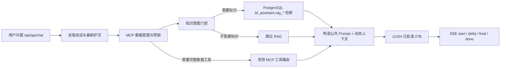

# 8093/8094 Prompt 固定 KV 前缀与知识库回答链路

追踪编号：`OPS-8093-8094-PROMPT-RAG-RUNTIME-20260805`  
当前运行核查与验收时间：`2026-08-05 08:44:59 +08:00`

## 1. 结论

1. 之前固定的不是模型内部可直接配置的“注意力分数”，而是**稳定的公共 Prompt token 前缀**。身份、安全边界、回答逻辑/风格和固定工艺规则始终排在动态炉况、数据库结果、知识证据、对话和用户问题之前，使 Ollama/模型运行时有机会复用相同前缀的 attention/KV 计算。
2. 8093 和 8094 的 `/api/qa/chat` 当前都使用同一套智能助手后端和同一套公共 Prompt 模板。每次正常问答都会构造该模板；是否检索知识库不影响公共模板本身是否加载。
3. 两个端口的知识库链路当前都启用，默认 `top_k=6`，并由意图门控决定是否检索 PostgreSQL `bf_assistant.rag_*`。知识证据命中后会注入同一 system prompt 的 `【知识证据】` 动态区。
4. 知识库**不是每一个问题都检索**。原理、原因、规则、阈值、制度、手册、文档、引用、来源等问题进入 RAG；当前值、实时数据、趋势、统计、图表等问题优先走 MCP/数据库；问候、服务状态、身份和安全套取问题跳过 RAG。
5. 8093 与 8094 当前都显式使用 `BF_QA_KNOWLEDGE_SEARCH_MODE=keyword`。知识问题只做 PostgreSQL 关键词/词法检索，不调用 embedding；这与 11434 的 `OLLAMA_MAX_LOADED_MODELS=1` 单 27B 驻留策略一致。8093 原先空值回退 `hybrid` 的风险已于 2026-08-05 通过受控部署消除。

## 2. “固定注意力分数”的准确含义

### 2.1 没有固定模型内部数值分数

应用代码没有向 Ollama 提交“固定 attention score”“固定注意力权重”或持久 KV cache ID，也没有修改 27B 模型内部注意力矩阵。这里的“固定”指下面这些文本及顺序保持稳定：

```text
固定身份
→ 固定职责与使用原则
→ 固定安全边界
→ 固定回答逻辑
→ 固定回答风格
→ 固定工艺规则
→ 动态炉况
→ 动态主动资料
→ 动态数据库/MCP 结果
→ 动态知识证据
→ 近期对话
→ 当前问题
```

当多个请求的开头 token 相同时，运行时才有机会复用公共前缀的 KV 计算。是否真正复用、复用多少不能只从模板顺序推断，应结合 Ollama 的 `prompt_eval_count`、`prompt_eval_duration` 和首 token A/B 观测。

### 2.2 代码如何实现

| 层次 | 实现 | 作用 |
|---|---|---|
| 固定主模板 | [QA_SYSTEM_PROMPT_TEMPLATE:L188-L254](../高炉前端数据/智能助手/backend/ollama_proxy_server.py#L188-L254) | 固定身份、职责、安全边界、回答逻辑和回答风格；动态区只保留占位符 |
| 固定工艺规则 | [QA_PROJECT_RULES_BLOCK:L257-L270](../高炉前端数据/智能助手/backend/ollama_proxy_server.py#L257-L270) | 压差、透气性、气流、热制度和调控边界等稳定规则 |
| 单轮拼装 | [build_hidden_qa_messages:L4880-L4938](../高炉前端数据/智能助手/backend/ollama_proxy_server.py#L4880-L4938) | 把固定规则填入模板，再依次注入动态炉况、主动资料、MCP 结果和知识证据 |
| 顺序合同 | [test_fixed_rules_precede_all_dynamic_prompt_sections:L460-L477](../高炉前端数据/智能助手/tests/test_qa_latency_optimizations.py#L460-L477) | 断言固定规则早于炉况上下文，炉况上下文早于项目/MCP/知识动态内容 |
| 长期规则池 | [8093 固定 KV 前缀模板规则池](../PT/8093固定KV前缀模板规则池.md) | 约束哪些内容可固定、哪些内容必须每轮更新 |

因此，这个方案是“固定 token 前缀 + 动态证据后置”，不是“缓存回答”，也不是“固定旧炉况”。

## 3. 每次 8093/8094 问答实际经过的链路



后端在 [prepare_qa_chat:L6866-L6953](../高炉前端数据/智能助手/backend/ollama_proxy_server.py#L6866-L6953) 中按以下顺序准备请求：

1. 读取 PostgreSQL 会话、最新快照、8 小时趋势和主动选择资料。
2. `qa_mcp_prefetch()` 判断是否需要当前值、历史、统计等确定性数据库结果。
3. `qa_search_knowledge()` 执行知识意图门控和 RAG。
4. `qa_mcp_should_use_tools()` 判断是否需要完整 MCP 工具轮。
5. `build_hidden_qa_messages()` 把所有动态事实注入公共 Prompt。
6. 普通问题直接调用 27B；需要工具的问题在同一消息基础上追加 MCP bridge 提示并执行只读工具。

## 4. 知识库回答链路

### 4.1 意图门控

[qa_should_search_knowledge:L4771-L4857](../高炉前端数据/智能助手/backend/ollama_proxy_server.py#L4771-L4857) 的当前规则为：

| 问题类型 | 是否走知识库 | 主要链路 |
|---|---:|---|
| “为什么、原理、规则、阈值、制度、基线、机理” | 是 | RAG → 知识证据注入 → 27B |
| “知识库、文档、手册、引用、来源” | 是 | RAG → 知识证据注入 → 27B |
| “当前、最新、实时、多少、趋势、曲线、历史、统计” | 否 | 最新炉况或 MCP/数据库 → 27B |
| 明确点位、图表、报表、复合数据分析 | 通常跳过 RAG | MCP 预取或受控 MCP 工具轮 → 27B |
| 问候、在线状态、身份、安全边界套取 | 否 | 公共 Prompt 直接回答/拒绝 |
| 其它普通工艺解释 | 默认是 | RAG → 27B |

MCP 预取已经取得完整数据时，知识门控会返回 `data_prefetch_already_used`，避免同一问题同时做重复数据库取数和不必要的知识检索。

### 4.2 PostgreSQL 检索和证据注入

- [qa_search_knowledge:L4860-L4876](../高炉前端数据/智能助手/backend/ollama_proxy_server.py#L4860-L4876) 使用 `QA_KNOWLEDGE_TOP_K` 和当前 search mode 调用知识检索。
- [search_knowledge:L666-L724](../高炉前端数据/智能助手/backend/bf_knowledge_rag.py#L666-L724) 固定访问 PostgreSQL `bf_assistant.rag_document`、`rag_chunk` 和可选 `rag_chunk_embedding`，不再使用旧 SQLite RAG 文件。
- `keyword` 使用 PostgreSQL 词法候选；`vector` 使用 pgvector 和 embedding；`hybrid` 合并两类候选后统一重排。
- 命中的前 `top_k=6` 条证据经 `evidence_pack_text()` 转成动态文本，再由 [知识证据注入:L6926-L6939](../高炉前端数据/智能助手/backend/ollama_proxy_server.py#L6926-L6939) 写入 `【知识证据】` 区。
- Prompt 明确要求：有知识证据时优先依据证据；证据与问题不完全匹配时说明适用边界，不能编造。

## 5. 2026-08-05 当前 8093/8094 运行态

只读探针：[probe_8093_8094_prompt_rag_runtime.ps1](../tools/probe_8093_8094_prompt_rag_runtime.ps1)。探针不发送 `/api/qa/chat`、不启停服务、不写数据库；知识连通性验证强制使用 `mode=keyword`，避免让单模型 11434 加载 embedding。

### 5.1 共享后端

两个端口的进程命令行都指向：

```text
F:\高炉炼铁项目-real-sensor-v2_V4_8093_PREVIEW\高炉前端数据\智能助手\backend\ollama_proxy_server.py
```

当前远端后端 SHA-256：`B4DFBDF15BD7C1D2D731BEB2A45238C881FEC75B71F2304D619DEF3D2F2C812A`。探针确认以下运行代码标记均存在：

- `QA_SYSTEM_PROMPT_TEMPLATE`
- `QA_PROJECT_RULES_BLOCK`
- `build_hidden_qa_messages`
- 固定规则位于动态炉况之前
- `qa_should_search_knowledge` / `qa_search_knowledge`
- RAG 证据注入
- MCP 预取和 MCP 工具路由

### 5.2 两端口当前配置

| 项目 | 8093 | 8094 |
|---|---|---|
| PID（正式变更后） | `15352` | `9976` |
| 公共 Prompt 模板 | 启用，同一后端 | 启用，同一后端 |
| 知识库总开关 | 空值按默认 `true` | 空值按默认 `true` |
| 知识意图门控 | 空值按默认 `true` | 空值按默认 `true` |
| `top_k` | 空值按默认 `6` | 空值按默认 `6` |
| 检索模式 | 显式 `keyword` | 显式 `keyword` |
| MCP 预取 | 空值按默认启用 | 空值按默认启用 |
| MCP 工具 | 空值按默认启用 | 空值按默认启用 |
| MCP 模式 | 空值按默认 `auto` | 空值按默认 `auto` |
| 只读关键词知识探针 | HTTP 成功，返回 2 条证据 | HTTP 成功，返回 2 条证据 |

11434 当前为 `OLLAMA_MAX_LOADED_MODELS=1`、`OLLAMA_KEEP_ALIVE=24h`。因此：

- **8094**：会加载公共 Prompt，也会按意图进入知识库；知识检索使用 `keyword`，不会为了查询向量而加载 embedding。
- **8093**：与 8094 相同，会加载公共 Prompt，并在知识意图命中后使用 `keyword`。配置文件和实际监听进程环境均已核对，默认知识搜索接口也返回 `search_mode=keyword`。

### 5.3 8093 正式切换与真实问答证据

- 正式部署时间：`2026-08-05 07:25:21 +08:00`。
- 配置补丁器：[patch_8093_keyword_knowledge_mode.py](../tools/patch_8093_keyword_knowledge_mode.py)；受控部署器：[remote_guarded_deploy_8093_keyword_knowledge_mode.ps1](../tools/remote_guarded_deploy_8093_keyword_knowledge_mode.ps1)。部署器先校验已知配置、守卫、共享后端和 RAG 哈希，只暂停 8093 健康任务、停止/启动 8093 服务，并在失败时自动回滚。
- 远端备份：`F:\高炉炼铁项目-real-sensor-v2_V4_8093_PREVIEW\logs\deploy_backups\8093_knowledge_keyword_20260805_072445`。
- 8093 配置 SHA-256 从 `D20F01F1E66FF8973AB6720DDEB450AEE50FAE2AC6FFB023E1C04EACA066EACA` 变为 `8A24C83DF93008DD8E358682558E8755442D87052A09FB24F39778F2EAF51FDE`。共享后端保持 `B4DFBDF15BD7C1D2D731BEB2A45238C881FEC75B71F2304D619DEF3D2F2C812A`，RAG 保持 `C42CA839CD83541F679D348B6652B0BFFC1AAB2EE72D96C3B08395A70E6289AA`。
- 只更换 8093 PID（`10996 -> 15352`）；8768/8094/8770/11434 PID、两端口页面、共享后端/RAG、守卫和 11434 配置均未改变。健康合同仍为 `3/1/15/600`，任务结果为 0，状态计数清零，11434 只驻留批准的 27.8B。
- `2026-08-05 08:44:59` 使用 [关键词知识 SSE 单次验收包装器](../tools/remote_verify_8093_keyword_knowledge_sse_once.ps1)只发送 1 个 `/api/qa/chat` POST。准备态明确记录知识检索启用、未跳过、意图 `parameter_optimization`、MCP 工具调用关闭；默认知识搜索前后均为 `keyword` 并命中 2 条证据。SSE 完整收到 `start(preparing/prepared) -> delta -> final -> done`，首个 delta `11709.7ms`、final/总耗时 `23885.4/23885.6ms`，期间无守卫重启、相关 PID 与模型驻留均未变化。
- 远端验收报告：`F:\高炉炼铁项目-real-sensor-v2_V4_8093_PREVIEW\logs\acceptance\8093_keyword_knowledge_20260805_20260805_084403\assistant_keyword_knowledge_sse_once.json`。

## 6. 回答用户问题时的准确表述

可以表述为：

> 8093 和 8094 每次智能助手问答都会加载同一套固定公共 Prompt；知识库链路也已启用，但只有知识意图命中时才检索。实时数据类问题优先走最新炉况/MCP，而不是强制走 RAG。当前两个端口都显式使用关键词/词法检索，不会在这条问答链路中调用 embedding。

不得表述为：

- “我们固定了模型内部注意力分数。”
- “所有问题都会调用知识库。”
- “8093/8094 只要页面能打开就证明 RAG 生效。”
- “公共 KV 前缀会缓存实时炉况或旧答案。”
- “keyword 等同于向量语义检索，或所有问题都一定命中知识证据。”

## 7. 验证命令

本地语法和固定前缀顺序：

```powershell
$text = Get-Content -LiteralPath 'tools\probe_8093_8094_prompt_rag_runtime.ps1' -Raw -Encoding UTF8
[void][ScriptBlock]::Create($text)
python -m pytest -q -p no:cacheprovider `
  tests\test_8093_8094_prompt_rag_contract.py `
  '高炉前端数据\智能助手\tests\test_qa_latency_optimizations.py::QaLatencyOptimizationTests::test_fixed_rules_precede_all_dynamic_prompt_sections'
```

远端当前运行态：

```powershell
$env:PYTHONPATH = (Resolve-Path -LiteralPath '.tmp_pylibs').Path
python .\tools\remote_22012_exec.py --allow-agents-password --no-profile --timeout 60 `
  --workdir 'C:\Windows\Temp' `
  --script '.\tools\probe_8093_8094_prompt_rag_runtime.ps1'
```

`exec_command` 单次等待不得超过 `4000ms`；获得会话后使用短轮询。探针输出不得包含数据库密码、Token 或连接串。

8093 关键词模式发生漂移时，使用受控部署器恢复；PowerShell 5.1 必须显式按 UTF-8 读取上传的脚本，避免中文路径/文本按 ANSI 解析：

```powershell
$env:PYTHONPATH = (Resolve-Path -LiteralPath '.tmp_pylibs').Path
python .\tools\remote_22012_exec.py --allow-agents-password --no-profile --timeout 60 `
  --workdir 'C:\Windows\Temp' `
  --upload 'tools\patch_8093_keyword_knowledge_mode.py=C:\Users\Administrator\AppData\Local\Temp\patch_8093_keyword_knowledge_mode.py' `
  --upload 'tools\remote_guarded_deploy_8093_keyword_knowledge_mode.ps1=C:\Users\Administrator\AppData\Local\Temp\remote_guarded_deploy_8093_keyword_knowledge_mode.ps1' `
  --command "& ([ScriptBlock]::Create((Get-Content -LiteralPath 'C:\Users\Administrator\AppData\Local\Temp\remote_guarded_deploy_8093_keyword_knowledge_mode.ps1' -Raw -Encoding UTF8)))"
```

## 8. 后续建议

当前选择是让 8093/8094 都显式使用 `keyword`，并已完成受控重启和真实知识问答验收。后续若需要向量语义召回，应先把 embedding 迁移到独立端口/运行时，再做容量、驻留、RAG 质量与 SSE 验收；不能把共享 11434 的 `OLLAMA_MAX_LOADED_MODELS` 改回 `2`。任何运行期环境变量调整都必须受控重启对应代理，并重新核对实际进程环境、默认知识检索模式、证据命中、SSE 和 `/api/ps`。
