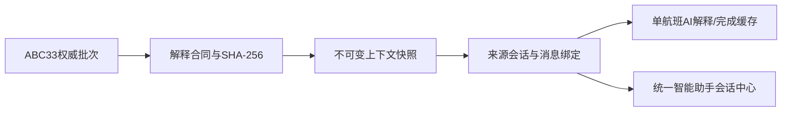

# ADR-0003：ABC33 上下文智能助手

- 状态：本机实现完成，待 8094/8093 生产验收
- 日期：2026-08-11
- 需求：`REQ-ABC33-EXPLANATION-CONTEXT-20260811`、`REQ-ABC33-CONTEXTUAL-ASSISTANT-POPUP-20260811`、`REQ-QA-UNIFIED-ORIGIN-CONVERSATIONS-20260811`

## 决策

1. `abc_rule_engine.evaluate_rule()` 与 `bf_sensor.abc_rule_evaluation_*` 仍是唯一评分事实源；不建立第二套公式、权重或处置规则。
2. 现有 `/api/furnace-rules/latest` 与 `/detail` 保持生产脱敏合同。新的权限接口只按 `rule_id + evaluation_id` 从服务端重读权威行，浏览器提交的分数、权重、上下文或 Prompt 一律拒绝。
3. 每个计算上下文转换为 `abc_rule_explanation_context.v1`，以规范 UTF-8 JSON 计算稳定 SHA-256，并作为不可变快照绑定到会话和消息。
4. 首轮 AI 解释按需生成，不做“33 项 × 每五分钟”预生成。同一 `context_snapshot_id + prompt_version + model_name` 使用 PostgreSQL 原子 claim、短租约和完成缓存实现跨 8093/8094 进程单航班；进程内事件只负责缩短等待，不能作为唯一互斥。模型生成期间不持有 PostgreSQL 连接。
5. 模型只能解释形成原因、关注点和既有处置顺序，不能改分、改权重、改安全门禁或自动下发控制。
6. QA 会话和消息按登录主体隔离；浏览器写请求必须是同源 `application/json`，上下文会话请求使用严格五字段白名单。固定首次问题、权威上下文绑定和服务端输出校验共同防止缓存抢写、跨会话读取与浏览器伪造。
7. ABC 首次分析先要求模型返回严格结构，再由服务端验证字段、公开 `term_id`、数值引用、处置顺序和 C 类安全提示；只有验证通过才写入 `completed` 缓存并渲染为现场可读文本。

## 为什么可行

- 数值事实始终来自已保存的内部计算项，模型无法接受浏览器伪造值。
- 确定性解释先显示，模型、知识检索或 SSE 故障不会让公式项和五步处置消失。
- 快照不可变且按消息绑定，后续新批次不会覆盖历史回答当时的依据。
- 数据库 claim/租约让 8093 与 8094 同时命中同一快照时仍只产生一个模型 owner；唯一键不再只是“事后合并结果”。
- 会话 owner、同源 JSON 和严格请求白名单阻断跨会话枚举、CSRF 触发及任意字段扩张。
- 公共 Prompt 前缀继续按“身份→安全边界→回答规则→固定工艺规则”稳定排列；单炉框动态上下文位于后部，便于运行时复用公共前缀的 attention/KV 计算。

## 回滚

关闭前端资源和上下文入口即可回到旧问答；新增四张表保留审计数据，不执行 DROP。生产文件失败按 8093 受控部署备份回滚，守卫恢复位于 `finally`。
