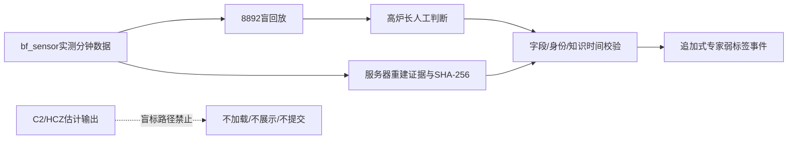
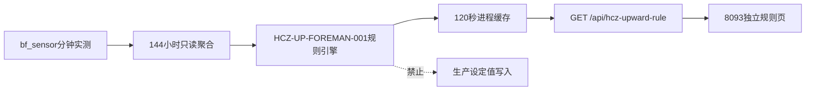
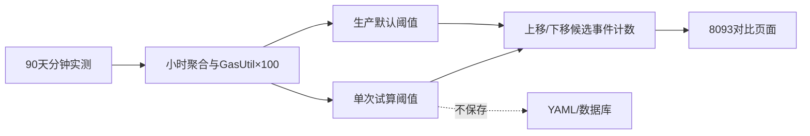

# 系统架构

本文件记录当前仓库中与高炉生产页面、实时诊断、建议引擎和模型解释相关的稳定边界。详细运行、数据库和服务配置分别见 `docs/V3本地运行依赖与启动手册.md`、`docs/数据库账号配置说明.md` 与 `docs/自动值守程序配置索引.yaml`。

## 参数优化建议链路

```text
PostgreSQL分钟数据 / pSpace当前值
  -> 8768 WebSocket诊断与 multi_condition_recommendation.v1
  -> 8093、8094同一前端建议工作台
       -> 8炉况切换
       -> 4项规则主证据
       -> 19项核心证据中心
       -> 动作审计抽屉
       -> /api/diagnosis/model-review 只读解释抽屉
```

- 8768 是8093与8094共同的规则建议数据源；页面修复不得创建第二套规则事实或改写动作。
- [OptimizationVisualWorkbenchLayout](../高炉前端数据/frontend_dashboard_v3.server.html#L10591)只负责选择炉况、组织可视区和打开只读详情。
- [BFCoreEvidenceCenterV2](../高炉前端数据/frontend_dashboard_v3.server.html#L10587)复用现有分钟缓冲、基线和pSpace当前值适配器，不新增数据库表或生产写接口。
- [useDiagnosisModelReviewV2](../高炉前端数据/frontend_dashboard_v3.server.html#L10564)只对当前有效主炉况自动复核；假设炉况由用户明确点击后才调用，模型结果不能修改规则分数、动作幅度或安全门禁。
- 纯HTML/CSS/浏览器组件发布采用页面原子热更新；服务代码、端口和运行进程保持不变。设计取舍见 [ADR-20260806](decision_records/ADR-20260806-recommendation-visual-workbench.md)。

## A9/B13/C11规则边界（REQ-ABC33-FURNACE-RULES-20260807）

33项规则与现有8类诊断并行计算，不覆盖旧 `raw_scores`。`diagnosis_scheduler.py` 保存完整 `abc_rule_bundle_internal` 并写入ABC审计表；`local_pg_ws_bridge.py` 只重建 `abc_rule_bundle.v1` 生产白名单。生产详情通过 `/api/furnace-rules/*` 查看传感器、复核、处置、观察窗口和手册依据；管理员才可访问 `/api/admin/furnace-rules/*` 的公式、权重、精确阈值和贡献。`Q_blast` 只能作为证据，定量调节对象仍由既有建议合同限制为 `P_blast_cold` 与 `PCI_set`。

## 炉体温度历史回放边界（2026-08-08）

`浏览器8892 -> soft_zone_replay_server.py -> PostgreSQL只读分钟表`是一条独立展示链，不经过8093/8094代理、8768诊断或生产控制接口。服务按请求时间窗聚合80个炉体温度点，在浏览器Canvas执行周向/纵向插值与红外色谱渲染；视频由现场Edge使用`canvas.captureStream + MediaRecorder`在客户端生成，服务器不保存视频。固定时间窗色阶保证拖动过程中颜色含义不漂移。

## V20可配置预测调度架构（2026-08-09）

```text
页面选择 1/10/30/60/1440 分钟
        -> POST /api/si-v20/schedule/configure
        -> bf_assistant.si_v20_prediction_schedule

Windows任务（固定每分钟，IgnoreNew）
        -> POST /api/si-v20/schedule/dispatch
        -> 读取到期配置 -> V20预测
        -> bf_assistant.si_v20_prediction_audit

历史批量/指定时刻
        -> POST /api/si-v20/scheduled-replay
        -> bf_assistant.si_v20_prediction_run
        -> 每个 schedule_slot_ts 一条预测审计
        -> GET /api/si-v20/scheduled-history
        -> 时间槽预测曲线 + 下一真实炉次Si
```

页面调整周期只更新数据库配置，不直接操作Windows计划任务。分发器固定一分钟轮询，因此最小支持周期为一分钟；`IgnoreNew`防止模型运行重叠。若分发器长期中断，恢复时不会自动制造大批伪实时点，过期时间槽从当前对齐槽恢复；真正历史补算必须显式使用历史批量入口。

## 软熔带移动本机诊断边界（2026-08-10）

```text
一分钟CSV / pandas DataFrame
  -> 15min历史参考 + 15min隔离 + 15min当前窗口
  -> 文档特征提取与单位/新鲜度门禁
  -> 解释型上移/稳定/下移概率 + 关联炉况证据
  -> 可选并行调用既有C2根部几何估算器
  -> 本机UTF-8 JSON
```

[特征融合层](../炉况规则引擎/features/cohesive_zone_intelligent_diagnosis.py#L214-L469)与既有C2几何估算器并行，不修改8767快照、8768诊断或8类炉况规则事实。其`feature_vector/trend_vector`是未来有真值后训练时序模型的边界；在取得经接受的`H_cz`标签、时间切分回测和现场标定前，输出只属于未标定诊断证据。

## HCZ人工弱标签边界（2026-08-10）

8892同时承载实测回放和独立HCZ标注页，但两个输出边界隔离：普通回放仍可显式加载低置信度C2估计；`hcz-labeling.html`只嵌入`/?labeling_blind=1`，强制`include_cohesive=0`并隐藏估计UI。父页只接收时刻、窗口和实测覆盖消息，服务器再从`bf_sensor.one_minute_values`重建证据并哈希，最后向`bf_assistant.hcz_expert_label_events`追加弱标签。



此数据集只能作为后续训练/回测候选。建模必须按`available_at`切分，并区分同期盲标和含事后证据的回看标签。

## HCZ上移经验规则8093只读链路（2026-08-10）



规则适配器复用8093既有本地PostgreSQL连接，但只执行`max(ts)`和144小时小时聚合查询；不新增表、任务或写接口。页面只消费同源API。该链路与8892人工弱标签分离：8093规则是可解释经验指示，8892标签是后续训练候选，两者都不是直接HCZ测量真值。

2026-08-11增加的阈值敏感性链路仍保持只读：API最多读取90天历史及前置143小时基线，先聚合/规范化一次，再分别套用生产默认与浏览器传入的临时阈值。`GasUtil`只在API入口由比例乘100；规则引擎统一按百分点计算。输出不会反写YAML或数据库，下移分支仅为上移方向符号镜像的候选比较。


# 220.12持久运维传输层（2026-08-10）

本机现在有两条互补的持久传输：8093 Skill默认使用`remote_22012_session.py`持有Paramiko transport与串行SFTP通道，适合独立PowerShell payload、上传和受控部署；Reliable SSH MCP使用常驻Plink进程和远端Python JSON runner，适合多次结构化命令并把复用调用降到亚秒级。两者都绑定既有受控凭据路径，不共享密码到日志，也不自动重放状态不确定的命令。

## QA 炉体温度复合工具与执行可观测性

炉体多层统计采用“确定性路由优先”架构：中文语义目录和层/方位解析器先把问题收敛为一个矩阵
对象，`gl02-extended` 再用一次只读数据库批量查询完成分钟对齐与统计；模型不承担点位展开或数值
计算。通用跨源 DAG 和模型自由规划只能在没有命中该复合计划时运行。

后端通过 SSE 发布脱敏 `public_trace`，前端把路由、工具、数据库结果和受控模型解释显示为执行
详情。执行摘要与隐藏推理严格分离：摘要可审计且可展示，内部思维链、SQL、连接信息和完整工具
结果不进入 UI。模型解释是确定性答案之后的可丢弃增强层，失败不得覆盖工具事实。

`pwsh -File`边界保持不变：复杂远端流程始终是独立UTF-8 `.ps1`。Reliable SSH诊断包由runner结构化安全解压ZIP，再以精确argv启动PowerShell 7 `-File`，不再把展开、部署和退出拼进`powershell.exe -Command`。

部署学习层只在`LOCALAPPDATA`保存计时、阶段、错误类型和脱敏指纹。动态错误达到重复阈值后仍只是候选；只有经过复现、双成功修复和测试后才能进入Skill评审规则库，因此远端内容无法成为本机自动执行指令。

# 8093验收分级与首屏加载边界（2026-08-10）

验收层把部署事务安全与浏览器覆盖强度分开：任何等级都保留备份、互斥、守卫恢复、失败回滚、HTTP/API和受保护PID检查；浏览器覆盖按`quick(4) → standard(17) → full(85)`升级。完整跨内核矩阵属于本机/预览测试，不再作为每次小改动对生产发起85次冷加载的理由。

当前页面仍是约907KB的单体HTML，内含浏览器端`text/babel`程序；启动依赖使用React开发版、ReactDOM开发版、Babel和ECharts，本地合计约5.35MB，三维GLB约8.23MB。生产HTML响应未启用gzip/Brotli且为`no-store`。目标结构应是“构建期JSX/TS编译 + 生产React + 路由动态bundle + 哈希静态资源 + HTML压缩 + overview路由再加载Three/GLB”。完成这类共享架构变更时才触发85项完整矩阵。

# Codex经济型委派边界（2026-08-10）

主任务是生产授权与最终判断的唯一所有者。经济型委派层先判断“无需模型/Luna/Terra/Sol”，再通过隔离的`codex exec`完成一个可独立验收的本地子任务。默认worker只有本地只读shell、最小项目指令和ephemeral上下文；结果回到主任务后必须独立验收。

8093快路径分为两阶段：`Phase A冻结diff/构建测试一次 → Luna low最小diff审查 || 只读远端预检 → 密封prepared-release`，随后`Phase B刷新远端哈希 → 校验清单/生成delta-plan → 只上传变化文件 → 一次守卫临界区 → 确定性HTTP/API → 必要时浏览器冒烟`。Luna不在生产控制链中，机械哈希/清单不调用模型；零差量不重启8093。

Skill采用“项目版本源→全局运行镜像”结构：仓库`.codex/skills/deploy-8093-guarded-update`随项目追踪，`tools/sync_deploy_8093_guarded_update_skill.ps1`只允许显式导入、单向发布或只读校验，并以14文件白名单和bundle SHA-256拒绝漂移；用户目录下的同名Skill仅供Codex自动发现，不再作为独立编辑源。

## ABC33 上下文助手（2026-08-11）

ABC 计算层不调用模型。服务端按评估批次构造确定性解释与哈希快照，再把快照绑定到既有 `qa_conversations/qa_messages`；首轮模型解释使用单航班缓存，生成前释放数据库连接。浏览器只传标识符。完整取舍见 [ADR-0003](adr/0003-abc33-contextual-assistant.md)。
