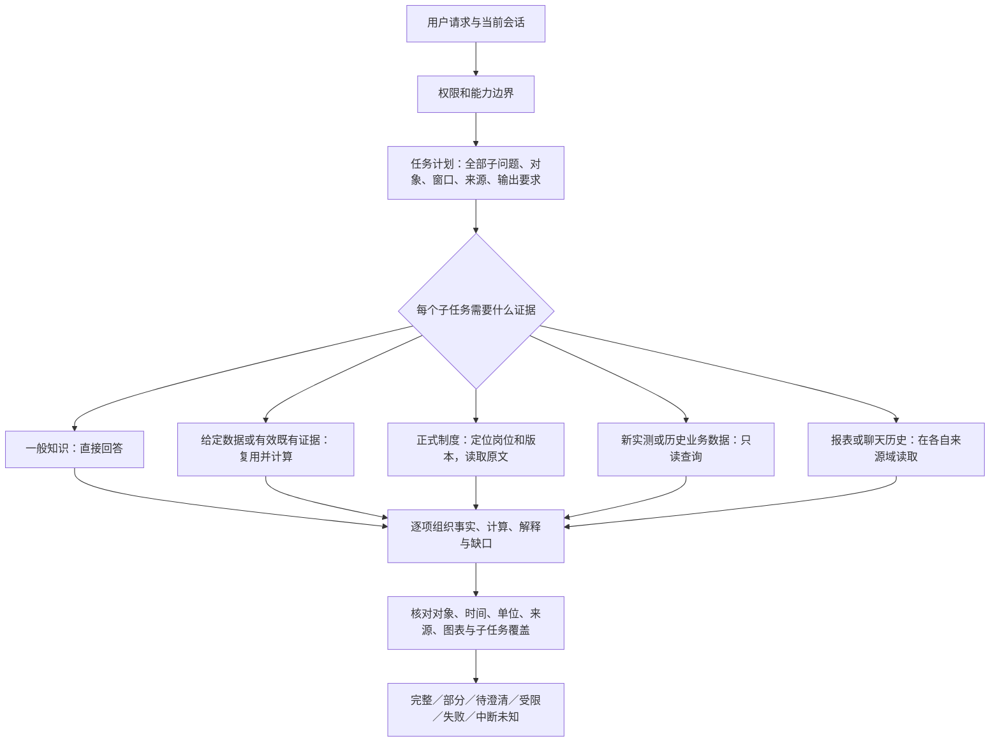

# 智能助手：全量问题统计与逐项优化实施方案

- 状态：统计已对账；方案供实施与验收；不代表全部问题已修复。
- 最后核对：2026-09-17；需求：REQ-QA-FULL-ISSUE-INVENTORY-20260916。
- 权威来源：首次最终语义判定、逐题采集账本、33 项执行台账、Reliable SSH 当日只读运行快照。
- 适用边界：本轮已登记来源与已测试能力；不等于穷尽所有自然语言问题。本次只读检查生产，未发送新问答、改变模型或切换服务。
- 本文补充[现有优化计划](2026-09-17-qa-full-optimization-plan.md)，详细当前核对项目见[33 项可勾选清单](../../tests/qa_regression/verified_optimization_checklist_20260917.md)。旧版“828 待审”“全部未实施”“六请求同时执行”的文字仅为历史，不作为当前执行指令。

## 1. 结论与主要优先项

路由存在已证实的设计和实现缺陷，但不是所有失败都由路由造成。主要链路是：任务理解/来源选择 → 对象和时间解析 → MCP 执行 → 完整证据保留 → 计算与解释 → 最终答案验收。模型驻留变化、知识原文/评分标准不足、工具生命周期异常也是独立问题。

改进顺序：先确保测试版本稳定与成功证据不丢失，再集中修复知识回答和任务覆盖，最后完成全量配对复测、防退化与长期维护。不要继续靠新增关键词或扩大工具轮数覆盖整个问题面。

当前最需要处理的五项：

1. 知识题首次 553 失败、85 部分正确，638 题进入修复复测，占 822 个失败/部分题的 77.62%。有原文覆盖不等于答题正确。
2. 工具结果、图表和最终答案的链路完整性；V25 的 18 点图表题只处理 16 点，生成的图未进入最终答复。V26 已有修复部署，但真实复测尚未产生答案。
3. 模型健康状态与实际 digest 一致性；V26 在发送第一题前已因身份变化阻断，无法给出本版准确率。
4. 无依据的实时主张、正常问题误拒和综合问题漏答；不应因“有文字”或部分事实正确而判整体通过。
5. 补齐审查标签与整改项映射，以及标准阻断/证据不足题的处理流程，避免统计完成但问题无法逐项关闭。

## 2. 全部来源与分母对账

|项目|数量|解释|
|---|---:|---|
|登记来源文件|77|已登记清单范围，不宣称磁盘中任意新增文件均已纳入|
|来源条目|1418|包含问题、重复、合同、夹具和跳过项|
|可发送 ready|1260|其中1259已收集，1题发送状态不确定|
|已收集|1259|包含26条结构说明误导入|
|清洗后有效且有结果|1233|1259−26，最终语义统计分母|
|重复来源|56|指向首条执行题，不重复发问|
|仅合同|84|31条用户输入合同、40个代码块、13个系统模板|
|仅夹具|7|在隔离测试链注入，不作为普通生产问题发送|
|跳过|11|保留理由|
|发送不确定|1|永久禁止自动重发，保留原ID|

恒等式：1418 = 1260 + 56 + 84 + 7 + 11；1260 = 1259 + 1；1259 = 1233 + 26。

知识来源另外对账：833 行 = 818 条唯一问题 + 15 条重复来源。后续原文覆盖审计的“803 条覆盖 + 30 条标准冲突”属于另一轮合同口径，不能与首次818题语义统计混算。

### 2.1 首次最终答案结果

|判定|题数|占1233有效题|
|---|---:|---:|
|完整正确|269|21.82%|
|部分正确|186|15.09%|
|失败|636|51.58%|
|标准/评分依据阻断|89|7.22%|
|证据不足，无法判定|53|4.30%|
|合计|1233|100%（分项四舍五入）|

可判定题1091，完整正确率269/1091=24.66%。全集保守完整正确覆盖率269/1233=21.82%。822=636+186进入失败恢复集合；142=89+53先补判定依据。部分正确不能混入完整正确；无法判定不能混入成功或默认失败。

首次结果由已有确定失败判定与828条逐题语义审核合并，并非本次重新人工审阅1233个答案。专业工艺判断、未经核实实时主张和标准争议仍须对应领域复核；统计有完整记录不代表评分标准已无争议。

|类别|总题数|完整正确|部分正确|失败|标准阻断|证据不足|
|---|---:|---:|---:|---:|---:|---:|
|知识|818|91|85|553|89|0|
|matrix 类|84|53|27|3|0|1|
|MCP 类|21|13|1|2|0|5|
|gold 类|8|6|1|1|0|0|
|其他|302|106|72|77|0|47|
|合计|1233|269|186|636|89|53|

gold 的8个已采集题与14条机器金标结构校验不是同一分母。分类沿用原始账本，不把所有含MCP调用的题都重新算为“MCP类”。

### 2.2 原始运行诊断信号

下表是首次1259条采集记录的信号，允许重叠、包含误导入行和合理降级；不是互斥根因或当前版本错误率。

|信号|涉及题数|意义|
|---|---:|---|
|工具错误|400|需再分注册、连接、参数、执行、清理阶段|
|工具超时|388|调用级TimeoutError为462次；题数与调用数分开|
|生命周期异常|258|底层共同原因尚不能统一归因于数据库或模型|
|无工具降级仍失败的路由|263|降级文字不等于任务成功|
|成功工具后又出现生命周期异常|43|重点验证成功证据保留|
|事实守卫拒绝|88|逐题判断合理拦截或误拒|
|实时拒答文本|120|不能仅由文本认定错误|
|含禁代码答复|53|独立审阅确认48题为正常问题误拒|
|知识题调用聊天历史|436|存在错误知识来源或无关搜索|
|知识题调用报表工具|147|其中67题出现报表目录式答案|
|知识题调用传感器/图表|73|核对是否被关键词带错路由|
|知识题检索测试标记|2|评测污染风险|
|无最终答案|1|必须明确失败，不能隐藏|
|残缺JSON|1|截断不能标成可信完成|

其他调用错误：NO_DRAWABLE_DATA 3次、TOOL_POLICY_REJECTED 3次、INSUFFICIENT_VARIABLES 1次。原始知识题p50/p95为43.046/121.157秒，其他题7.016/94.828秒；这些是历史采集耗时，不能当V26性能。

### 2.3 最终语义审核新增的20类标签

完整题ID、逐标签判定分布与建议整改映射见[语义问题对照表](../../tests/qa_regression/semantic_issue_crosswalk_20260917.md)。这些标签与原33项整改相交，不能相加成“53个独立根因”。

|缺陷标签含义|题数|缺陷标签含义|题数|
|---|---:|---|---:|
|知识答案质量/针对性不足|204|遗漏子任务|58|
|未经证据核实的实时断言|57|答案不满足输出合同|39|
|缺单位|16|缺知识原文|11|
|趋势方向自相矛盾|4|事实守卫误拒/校验错误|3|
|变异系数适用范围错误|2|对象不匹配|2|
|歧义输入处理不当|2|内部制度缺依据|2|
|现场主张超出证据支持|2|原文请求被改写|2|
|概念范围错误|1|统计显著性缺依据|1|
|点位映射未解决|1|错误说明不清|1|
|正常任务安全误拒|1|知识原文截断|1|

仍有9题为部分正确但无任何缺陷标签，已逐ID列入对照表，暂不指定未经证明的根因。既有台账的标签关联数只能表示排查范围，不能推算某修复能直接挽回多少题。

## 3. 当前生产与完成状态

Reliable SSH只读核对：r3为953/953、自动重试0、进程已退出；生产提交为`7d8a2b1a73fbd3e5b30cf800135ec32c3fa5548e`（V26），发布版本记录与文件哈希已匹配到本地验收材料。详见[运行快照](../../tests/qa_regression/runtime_readonly_snapshot_20260917.json)。

|阶段|当前可证实状态|不能据此宣称|
|---|---|---|
|首次采集|1259结果+1未知，全部来源有状态|全部来源都有效或全部答对|
|首次有效题审查|1233条有最终判定|142个未定题已解决|
|V25全量恢复计划|822题，已发1、失败1、821明确未发|优化后的全量准确率|
|V26代码发布|版本记录与字节核对确认|图表缺陷已线上复测通过|
|V26恢复计划|822题，progress显示发送0，模型身份门禁阻断，进程退出|可直接续跑；发送前仍须独立核对claim|

33项台账优先级：P0共12，P1共20，P2共1。状态分布：19项已部署但只部分验证，5项有代表性生产验证，1项仅知识覆盖/语义部分验证，1项依赖阻断，1项已部署合同验证，2项实施验证，1项实施部分验证，1项部分完成，1项首次审查完成但版本复测未完，1项持续维护。**没有证据支持“33项全部解决”。**

## 4. 目标路由：以任务与证据决定，而不是以关键词决定



### 4.1 路由决策表

|用户任务|默认路径|调用工具的条件|答案验收|
|---|---|---|---|
|一般工艺解释|无工具直接回答|用户明确要求本厂正式条款或现场验证时才补对应证据|不夹带虚构当前数据|
|给定表格、数组、截图中的数据分析|使用用户输入，必要时受控计算|输入不足或用户要求核查现场；不能擅自改来源|数据来自输入，计算可复算，假设明示|
|已查结果的解释或追问|复用有效证据|对象、窗口、来源、时效或权限不匹配才重新取数|明确原证据时间，不把旧值写成“现在”|
|当前/历史传感器数据|完整对象解析→只读查询|缺少本任务所需实测证据时|请求集合=成功集合+明确失败/缺失集合|
|制度原文/岗位规定|岗位、版本、章条定位→完整正文|需读取权威文档|原文不改写，不丢末段、表头、单位、适用条件|
|概括制度/解释条款|同上再做有引用的概括|必须有权威条款|概括不能引入原文没有的规定|
|报表问题|目录定位→正文读取→回答|“列报表”只需目录；“总结”必须正文|报告业务日期与文件修改时间分开|
|回忆聊天|当前owner范围内读取历史|用户要求回忆或明确历史依赖时|聊天仅证明说过什么，不能证明业务事实|
|综合问题|分解后分别走以上路径，再统一汇总|只查询尚缺证据的步骤|每个子问题有结果或明确缺项|
|代码与允许任务混合|隔离受限子任务|只执行允许的只读工具|不执行、不生成代码示例；保留查询、数学和解释|

允许数学公式、统计、图表和业务判断；禁用的是任意代码执行与面向用户的代码示例。预先批准的固定计算器和只读工具不因内部使用程序实现而被禁掉。

### 4.2 统一任务计划与执行合同

每个请求在任何数据预取前建立计划。计划至少记录：request/subtask ID、真实指令与引文区分、任务类型、完整对象集合、时区和起止时间、文档岗位/版本/章节、所需证据字段、可复用证据、允许/禁止能力、步骤依赖、预算、必答项。

明确常见任务走确定性解析；复杂任务可使用一次受结构约束的模型规划，输出必须验证。解析失败不得默认查实时数据。模型只建议计划，执行器按权限、来源白名单和工具schema强制校验。

一次请求内，无依赖且不同服务的步骤可受控并行；同一stdio服务和有依赖步骤串行。服务层同时只接纳一个问答owner，其他请求立即409、不排队。两者是不同层次的并发，不能混淆。

### 4.3 复合问题的可核对例子

请求：“比较三个高度A到F点在两个历史时段的温度，画图并结合规定解释；不要查询当前值。”

1. 先得到18个点、2个窗口、绘图、对比、条款解释等明确需求，锁定禁止当前值查询。
2. 按18×2检查数据覆盖；上限不足时按批准批量规则拆分，或明确范围限制，不静默只取16点。
3. 工具返回完整结构结果；缺失点显式列出。模型只看到有界摘要，证据账本保留完整结果。
4. 固定函数计算均值、变化、方向与覆盖率；图表必须来自同一批证据与时间窗。
5. 检索相应正式规定，并核对其岗位和适用条件。
6. 最终答案逐项包含比较结论、依据、图表、条款、缺失与限制；不能只给一段泛泛建议。

若原文缺失，可完成数据和图表部分，明确制度解释受阻；若生成模型不可用，仍返回可确定的表格、图和缺口。没有风险阈值或足够证据时，不判定“正常/危险”或擅自给生产调节值。

## 5. 33项整改总表：逐项销项

状态说明：“部分验证”不能勾为完成；“代表题通过”只说明相应场景；“待线上”包括V26代码已经发布但没有本版真实答案证据。完整实施动作、反例、依赖和销项材料在[可勾选清单](../../tests/qa_regression/verified_optimization_checklist_20260917.md)。

|ID|优先级|必须完成的动作|关键验收|当前证据边界|
|---|---|---|---|---|
|R01|P0|统一TaskPlan，所有预取和降级共用|引文不抢路由；综合题逐项覆盖|部分验证|
|R02|P0|聊天历史、业务数据、知识原文分域|回忆题不查当前值；跨owner不可见|部分验证|
|R03|P1|展开全部对象、方位、高度；检查上下限|18点逐点有结果/缺项；不静默截断|V26修复待线上|
|R04|P1|统一时区、明确窗口、独立基线|两个窗口均有证据；跨日边界正确|代表题通过，扩展待测|
|R05|P1|报表按目录→正文读取|摘要能回指正文，缺正文明确|代表题通过，扩展待测|
|R06|P1|权威诊断与指标分子任务执行|不以单指标代诊断，不漏子问题|代表题通过，扩展待测|
|R07|P1|无工具、用户数据、既有证据独立路径|禁实时请求零实测调用，数学正确|代表题通过，扩展待测|
|R08|P0|禁代码与正常能力分离|48误拒题恢复；混合请求保留允许部分|部分验证|
|R09|P1|能力描述来自注册、授权和健康状态|不否认可用绘图/查询，不虚报能力|部分验证|
|R10|P1|多轮只继承已确认对象/窗口/来源|追问有效，换题清理，旧值不冒充最新|部分验证|
|K01|P0|岗位制度原文独立检索|知识题不转历史聊天或现场工具|覆盖已验证，语义仍待复测|
|K02|P0|隔离聊天、测试答案与权威知识|测试标记不成为知识来源|部分验证|
|K03|P1|按结构读取章节、子章、表格和尾部|全文完整，角色正确，表头单位齐全|部分验证|
|K04|P0|缺制度明确缺失，不用一般知识补写|不存在的制度/阈值不编造|代表题通过，扩展待测|
|K05|P1|报表和制度独立来源域|目录不可冒充规定，复合题两源都回答|部分验证|
|K06|P1|文档与评分标准分别版本化|89标准阻断逐题处理；30冲突单列|部分验证|
|E01|P0|成功工具结果先保存，清理失败不清空|真实值、图表在降级后仍可见|V26修复待线上|
|E02|P1|证据绑定对象、时间、单位、质量、来源|单点不推历史趋势，证据不越域|部分验证|
|E03|P0|逐字段校验数值、舍入、换算、派生量|无未经核实实时主张，合法数字不误拒|部分验证|
|E04|P1|固定统计定义、质量门和复算|CV/近零均值/不规则采样/方向冲突正确|部分验证|
|E05|P0|所有最终出口检查必答项和截断|缺图/缺字段/残句不能标complete|V26相关修复待线上|
|E06|P1|跨源冲突与条件性判断|有对比结论，区分事实、推测、因果|部分验证|
|O01|P0|生成期间固定批准模型身份和调度边界|请求前后digest一致；漂移停止新发送|当前阻断|
|O02|P1|分阶段超时和局部降级|保留成功步骤；一次无工具最终回合上限|部分验证|
|O03|P1|schema、数组上限、步骤依赖检查|合法完整JSON；超限明确，不猜上游输出|合同已验；V26线上待测|
|O04|P1|页面/日志/评测使用一致状态和耗时|区分数据空、超时、身份变化、漏答|部分验证；UI待验|
|O05|P1|全服务独占、409、实际取消和释放|真实双角色隔离，无排队/重放|真实并发待验|
|T01|P0|唯一ID、claim、发送与结果哈希对账|1未知永不自动重发；未发才续跑|已实施验证，持续保持|
|T02|P0|导入清洗、去重、测试污染隔离|26误导入保留审计但不评分|部分验证|
|T03|P1|13模板绑定实际入口与最终Prompt哈希|每个入口有实测/阻断，7夹具各有结果|未闭环|
|T04|P1|失败恢复+正确题防退化+持出集|822恢复、269防退化、142先补标准/证据|首次审查完成，新版复测未完|
|T05|P1|冻结字节、独立审查、最小受控发布|HTTP/哈希/PID/版本与回滚证据齐全|机制已验证，持续保持|
|T06|P2|覆盖清单、质量趋势和新故障回归|来源缺口明确；每次新增问题可追踪|长期维护|

以上ID均省略共同前缀`QAOPT-`。R03虽在原台账列P1，但当前阻塞绘图恢复，应与E01/E05的首批修复一起验收，而不是等其他P1全部完成。

## 6. 智能助手完善：Prompt、分析、知识、体验

### 6.1 恢复原有Prompt目标，同时维持禁代码

基础Prompt建议统一为以下合同，再按任务附加最小分支说明；不是把所有规则无差别堆进每次上下文。

> 你是高炉业务智能助手，负责一般问答、工艺解释、正式文档检索、只读数据查询及基于证据的分析。先理解用户的全部目标，区分指令、引文、用户数据和已有证据。信息足够时直接回答，只有缺少必要证据时才调用获准工具。
>
> 对综合问题逐项回答，覆盖全部对象和时间范围。数据事实、统计结果、推断、正式规定分别注明来源。正式规定必须来自正确岗位与版本的原文；聊天和回归答案不能替代。缺少事实时说明具体缺项，不编造数值、单位、时间、条款或能力。
>
> 允许数学公式、统计、图表和有依据的条件性判断。禁止执行任意代码或生成代码示例、脚本、SQL和命令；若请求混合允许与禁止内容，完成允许部分并说明受限部分。不得自动改变生产设定。
>
> 工具失败仍保留已核实的结果。只有确实需要且允许时，才在同一请求内做一次无工具最终解释。先给结论，再给依据、缺口和必要的下一步；不能用泛泛拒答代替可完成的工作。

分支Prompt分别绑定 document/data/analysis/history/report/degraded合同。能力清单由实际工具注册、角色权限和健康状态派生。记录最终系统Prompt哈希、模板版本、模型digest；不能只记录某个源文件哈希便宣称实际Prompt已冻结。

### 6.2 数据分析可做与不可越过的边界

- 可直接做：用户给定数据的均值、差值、变化率、排序、趋势描述、条件性解释；已核实数据的同类分析。
- 必须补数据：用户问当前状态、历史趋势或相对基线，但上下文没有对应时间窗/基线证据。
- 必须补定义：询问“稳定、显著、偏高、异常”，但没有比较基准、统计定义或正式阈值。
- 可以给部分结论：数据支持“末值高于首值”，但回归方向相反时，分别说明，不强行统一成上涨趋势。
- 不可推定：只有当前一个点就判断半小时趋势；摄氏温度直接按CV定正式稳定等级；相关性直接写成因果；缺单位就猜单位；缺数填0。

固定计算器需明确总体/样本标准差、采样权重、时间对齐、缺失与Held质量、零分母、异常值和单位换算。每个派生值记录输入证据ID、公式与计算器版本，抽取关键量独立复算。

### 6.3 知识维护与答案组织

- 原文库元数据至少包含岗位、文档ID、批准版本、章节路径、页/行定位、来源哈希、生效范围。
- “引用原文”“概括要点”“结合数据解释”使用不同的输出要求，不能用一段改写完成原文请求。
- 索引需验证整份文档覆盖，也需验证被选章节的首尾和连续性；全局覆盖通过不能掩盖局部缺尾。
- 89条标准阻断区分原文缺失、标准缺失和标准冲突；30条原文/标准冲突另表版本化。改标准必须保留旧标准和依据，不以模型答案反向修订标准。
- 回答先给直接结论，再列必要证据和限制；只返回大量原文或统计数字不自动满足“分析判断”的请求。

### 6.4 页面与运行体验

- 页面显示明确阶段：理解问题、查询、计算、整理答案；数据已到而模型解释失败时，保留可用表格和图。
- `complete/partial/needs_clarification/restricted/failed/interrupted_unknown`映射到明确中文状态，SSE结束不能直接等于完整回答。
- 有界合并消息、历史分页，避免长会话反复传输所有答案。身份过期保留输入并提示登录后手动发送，不自动重放。
- 取消要反映实际后台终止，独占锁在任务真正结束后释放。共享访客房间不承载私有文档或operator历史。
- 日志记录请求/步骤ID、工具、预算、耗时、故障阶段、证据哈希与最终状态；公开报告不记录原始生产值或身份。

## 7. 实施批次与退出条件

以下为建议工作顺序和责任职能，不是工期承诺。每批按证据退出，不以“代码已写好”退出。

|批次|工作包|责任职能|交付和退出条件|
|---|---|---|---|
|S0 统计闭环|全题对账；20标签映射；9题补归类；142题确定补证路径|评测维护+工艺审核|1418来源状态、1233判定及所有未定/未归类ID可复算；原失败不被删除|
|S1 稳定性与证据|O01、E01/E05、R03/O03；审查现有V26，不重复重写|后端/MCP+运维|固定模型边界；18点、完整JSON、生命周期失败保图在同版本真实题上通过|
|S2 知识与策略|K01–K06、R08/R09、E03|知识维护+后端+工艺审核|知识题恢复；禁代码不误拒；无未经核实实时值或伪造制度；逐题有答案依据|
|S3 完整任务与分析|R01–R07/R10、E02/E04/E06|编排后端+数据分析|全对象/窗口/子任务覆盖；公式可复算；无工具和给定数据任务不误取现场数据|
|S4 运行与交互|O02/O04/O05、T03|后端+前端+评测|错误分层、真实409/取消/owner验证、13模板与7夹具闭环|
|S5 发布验收|T04/T05/T06贯穿各批|评测+独立审查+运维|822恢复集合、269防退化集合、独立持出集和关键重复可靠性报告；完成受控发布证据|

S1–S4各自先做针对性回归，可分成小候选交付；S5是每个候选的证据门，不是允许前面跳过验证。142题在依据补齐之前继续记阻断，不能为了凑满分随意降门槛。

模型管理器、计划任务或其他端口的改动需要独立授权，不把本方案视作已授权停用恢复任务。生产代码按既有8093受控流程；保持其他服务和模型配置边界。未核实claim之前，不从progress的0请求直接推导可自动续跑。

## 8. 回归集合与可核对验收标准

### 8.1 集合分层

|集合|当前规模|用途|
|---|---:|---|
|首次原始结果|1259+1未知|不可覆盖的历史证据|
|失败/部分恢复|822|逐题新版对比，不是同批次失败自动重试|
|首次正确防退化|269|防止修正知识或策略时破坏已有能力|
|标准/证据待补|142|依据齐全后形成新的可判版本|
|知识来源|833行|单列来源覆盖、去重、冲突、语义结果|
|系统模板/故障夹具|13/7|真实入口绑定与隔离故障链验证|
|新持出集|待建立并冻结|修复期间不可用于针对性调参；数量和各类配额发布前固定|

重复可靠性`pass^5`用于明确计划的新评估轮次或隔离夹具；每次独立ID、固定输入和版本，不允许用这个目标给旧的不确定请求重发。动态生产数据不相同的前后结果，只能报告实际恢复观察，不能直接归因于代码收益。

### 8.2 发布目标（建议验收门槛，不是现有成绩）

|维度|建议门槛/要求|
|---|---|
|语义对象|精确别名100%；口语Top-1≥97%；不存在的对象ID为0|
|路由与工具|选择正确≥98%；无关调用≤1%；依赖顺序100%；已知无工具反例全部通过|
|参数与协议|参数exact-match≥99%；schema合法100%；越权参数0|
|健康来源执行|成功率≥99%，来源故障单独列分母和原因|
|复合与多轮|已知漏答反例100%恢复；新持出集完整任务通过率建议≥97%；关键任务pass^5≥90%|
|事实忠实|每个实时断言可定位证据；数值误差≤1e-6或已声明业务容差；单位/时间/来源完整|
|知识|原文请求正确岗位/版本/范围100%；知识语义结果单列，不用原文覆盖替代|
|失败安全|编造实测、伪造制度、越权写入、泄露、错误重放均0；任何一项阻断发布|
|性能|确定性路由子阶段p95≤100ms、语义候选阶段p95≤300ms；端到端按题型测基线再定目标|
|并发与隔离|独占接纳+其他409；取消真实释放；跨owner泄露0；不排队、不重放|
|已知问题关闭|一项只有在对应已确认反例通过且关联正常任务无退化时才销项；阻断项单独保留|

报告每项分子、分母、样本数、错误绝对数量与版本。不同模型/Prompt/dataset版本分层，未测写未测，不计满分。有限回归通过不能保证任何新自然语言问题100%正确；工程目标是支持范围内可靠完成、缺证据时明确边界、失败可定位并持续进入回归。

### 8.3 每题与每项的闭环

每题记录case_id、源文件/行号、去重指向、请求hash、原结果hash、最终判定、子任务要求、工具与参数、证据引用、实际代码/模型/Prompt/schema/目录版本、新版结果与审查理由。

每项销项必须有：失败原题→已证明根因→最小修复→正常/反例/故障测试→独立答案审核→同版本真实复测→发布和回退证据。测试作者不能通过把标准答案注入被测提示词或知识库制造通过。

## 9. 代码与测试核对入口

以下行号已在本机核实。主工作树代理与生产候选采用受控差异构建，不能把本机旧代理行号解释为远端V26行号；生产以版本与字节清单定位。

|职责|本机入口|已有测试入口|
|---|---|---|
|任务计划/工具边界|[build_task_plan](../../高炉前端数据/智能助手/backend/qa_task_plan.py#L154)、[tool_allowed](../../高炉前端数据/智能助手/backend/qa_task_plan.py#L274)|[任务计划](../../tests/test_qa_task_plan.py)、[步骤完整性](../../tests/test_qa_step_plan_integrity.py)|
|禁代码/无工具/给定数据|[direct_result](../../高炉前端数据/智能助手/backend/qa_evidence_policy.py#L119)、[enforce_no_code](../../高炉前端数据/智能助手/backend/qa_evidence_policy.py#L134)|[策略测试](../../tests/test_qa_evidence_policy.py)|
|知识原文与章节|[execute_document_question](../../高炉前端数据/智能助手/backend/qa_document_knowledge.py#L226)、[inspect_selected_scope](../../高炉前端数据/智能助手/backend/qa_document_integrity.py#L65)|[知识](../../tests/test_qa_document_knowledge.py)、[完整性](../../tests/test_qa_document_integrity.py)|
|图表对象/证据保留|[parse_variables_arg](../../高炉前端数据/智能助手/mcp/bf_data_mcp_server.py#L1291)、[plot_gl02_trends](../../高炉前端数据/智能助手/mcp/bf_data_mcp_server.py#L2897)、[trend_chart_answer](../../高炉前端数据/智能助手/backend/qa_tool_fallback.py#L30)|[图表证据](../../tests/test_qa_chart_evidence.py)|
|数字忠实与统计范围|[answer_numbers_are_grounded](../../高炉前端数据/智能助手/backend/qa_evidence_claims.py#L96)|[数值校验](../../tests/test_qa_evidence_claims.py)、[统计范围](../../tests/test_qa_statistical_scope.py)|
|最终完成状态|[complete_model_response](../../高炉前端数据/智能助手/backend/qa_completion.py#L15)|[历史完成](../../tests/test_qa_history_completion.py)，全最终出口覆盖仍需补充|
|owner/多轮/请求控制|[load_owned_tool_context](../../高炉前端数据/智能助手/backend/mcp_conversation_context.py#L93)、[RequestState](../../高炉前端数据/智能助手/backend/qa_request_control.py#L21)|[来源边界](../../tests/test_qa_context_provenance.py)、[上下文边界](../../tests/test_qa_context_boundaries.py)|
|V26受控增量构建|[候选构建器](../../tools/build_qa_v26_chart_evidence_candidate.py)|运行前核对既有产物哈希，不在本次统计任务重建/部署|
|统计重建|[对账脚本](../../tools/build_qa_verified_inventory_20260917.py)|脚本内分母、唯一ID、分类计数、原结果hash、输入未漂移断言|

本次实际验证命令：

```text
python -X utf8 tools/build_qa_verified_inventory_20260917.py
python -X utf8 tools/evaluate_mcp_gold_tasks.py --validate
```

第一条预期`ok=true, rows=1418, valid=1233`；第二条14项结构验证通过，不等于14条线上回答通过。本次不以运行全部单元测试替代用户要求的统计与计划。

## 10. 交付物与公开边界

- [全来源逐题CSV](../../tests/qa_regression/verified_question_ledger_20260917.csv)：1418行，含最终首次判定与来源定位，可筛选核对；本报告仅发布这份已脱敏CSV，不扩大普通CSV上传范围。
- [完整机器统计与全题索引](../../tests/qa_regression/verified_inventory_20260917.json)：包含输入hash、所有分母、逐题ID、20标签和33项状态。
- [33项逐项验收清单](../../tests/qa_regression/verified_optimization_checklist_20260917.md)：实施动作、验收、回归场景、依赖和销项材料。
- [语义缺陷与整改映射](../../tests/qa_regression/semantic_issue_crosswalk_20260917.md)：含9个未归类题。
- [只读运行核对快照](../../tests/qa_regression/runtime_readonly_snapshot_20260917.json)：V26与复测阻断，排除身份和凭据。

GitHub只收脱敏索引、统计、方案和合成回归；原始会话、生产值、工具参数中的敏感字段、身份与凭据仍留受控位置。本文是当前请求的统计和计划交付，线上修复与复测结果继续以新版本证据更新，不将计划写成完成。
